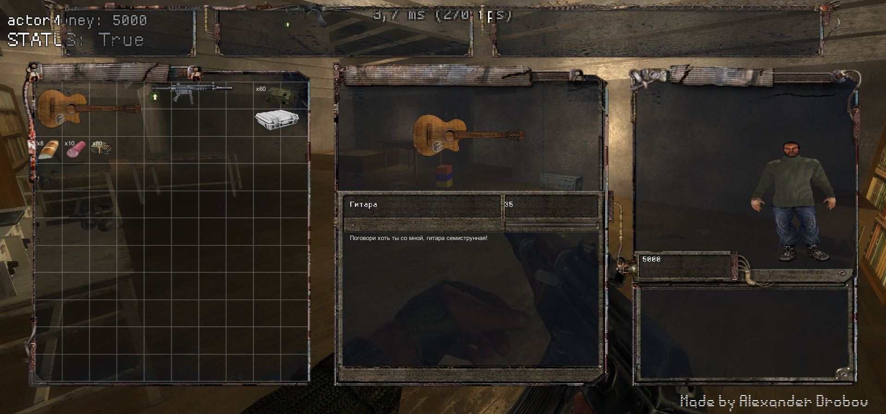

# Unity Inventory Stalker

---

## English | [Русский](#русский)

---

# English

## 📌 Overview

This project is a complete rewrite of the original inventory system from **UnityScript (JavaScript)** to **C#** to ensure full compatibility with **Unity 2022 and newer versions**

  
   
  <i>Inventory system from S.T.A.L.K.E.R.: Shadow of Chernobyl — ported to Unity 2022 (C#)</i>

## 🎮 About

This is a port of the **inventory system from S.T.A.L.K.E.R.: Shadow of Chernobyl** — a game developed by **GSC Game World**. The system replicates the iconic inventory UI and base mechanics from the original game, adapted for use in Unity3D

## 🚀 Features

- Fully rewritten in C#
- Compatible with Unity 2022+
- Faithful recreation of the STALKER inventory system
- Weapon and ammo system

## 📦 Download

You can download the full project source code as a `.unitypackage` in the **[Releases](../../releases)** section.

## 🛠️ Requirements

- Unity 2022 or newer
- No additional plugins or assets required

## 📂 Installation

1. Download the latest `.unitypackage` from [Releases](../../releases)
2. Open your Unity project
3. Go to `Assets` → `Import Package` → `Custom Package`
4. Select the downloaded file and import all assets

## 🙏 Credits

- **Original repository** — [syxme/unity-inventory-stalker](https://github.com/syxme/unity-inventory-stalker.git)
- **Original game** — S.T.A.L.K.E.R.: Shadow of Chernobyl by [GSC Game World](https://www.gsc-game.com/)
- **C# rewrite & Unity 2022 port** — [Alexander Drobov](https://github.com/MramorLomai)

---

# Русский

## 📌 Обзор

Этот проект - полное переписывание оригинальной системы инвентаря с **UnityScript (JavaScript)** на **C#** для **Unity 2022+**

  
   
  <i>Система инвентаря из S.T.A.L.K.E.R.: Тень Чернобыля — портированная на Unity2022 (C#)</i>

## 🎮 О проекте

**Система инвентаря из S.T.A.L.K.E.R.: Тень Чернобыля** — игры, разработанной **GSC Game World**. Система воспроизводит логику и UI инвентаря и базовые механики из оригинальной игры, портированные в Unity3D

## 🚀 Возможности

- Полностью переписан на C#
- Совместим с Unity 2022+
- Порт системы инвентаря STALKER
- Система оружия и патронов

## 📦 Скачивание

Вы можете скачать полный исходник проекта в виде `.unitypackage` в **[Releases](../../releases)**.

## 📂 Установка

1. Скачайте последную `.unitypackage` из [Releases](../../releases)
2. Откройте ваш проект в Unity3D
3. Перейдите в `Assets` → `Import Package` → `Custom Package`
4. Выберите скачанный файл и импортируйте

## 🙏 Благодарности

- **Оригинальный репозиторий** — [syxme/unity-inventory-stalker](https://github.com/syxme/unity-inventory-stalker.git)
- **Оригинальная игра** — S.T.A.L.K.E.R.: Тень Чернобыля (2007) от [GSC Game World](https://www.gsc-game.com/)
- **Переписывание на C# и порт для Unity 2022** — [Alexander Drobov](https://github.com/MramorLomai)
